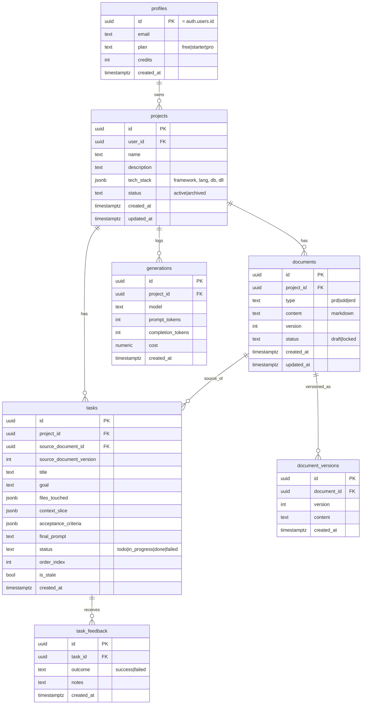

# DATABASE — Arsitek

Versi: 1.0 (MVP) · ORM: Drizzle · DB: Postgres (Supabase)

Skema ini adalah fondasi fitur pembeda (integritas konteks). Patuhi persis.
Relasi antar-artefak lah yang memungkinkan stale detection & konsistensi checker.

## ERD



## Catatan desain

- **profiles** memperluas `auth.users` Supabase (id sama). `credits` disiapkan
  untuk model kredit; belum ada payment di MVP.
- **documents.type** sudah menyertakan `sdd|erd` walau MVP hanya pakai `prd`. Ini
  agar fase berikutnya tidak perlu migrasi besar.
- **documents.version** naik tiap kali dokumen di-lock ulang setelah diedit. Nilai
  ini kunci stale detection.
- **document_versions** menyimpan riwayat isi tiap versi (untuk diff & regenerate).
- **tasks.source_document_version** merekam versi PRD saat task dibuat. Task stale
  bila `documents.version > tasks.source_document_version`.
- **tasks.context_slice** (jsonb) menyimpan potongan konteks relevan untuk task
  itu (entity terkait, aturan, dependensi). Fleksibel agar nanti bisa memuat
  potongan kode nyata (fitur codebase-aware) tanpa ubah skema.
- **tasks.acceptance_criteria** (jsonb) = array kriteria "selesai".
- **task_feedback** menopang loop belajar (Level 4): user menandai berhasil/gagal.
- **generations** mencatat biaya per generasi untuk basis kredit.

## Codebase-aware (Fase 4) — perubahan skema

Status: **rancangan**. Produk: PRD §9 · Arsitektur: ARCHITECTURE §9–§11.

Prinsipnya: **tidak ada tabel baru**. Snapshot repo adalah dokumen turunan
project yang berversi — persis bentuk yang sudah dilayani `documents` +
`document_versions`. Membuat tabel `codebase_snapshots` sendiri berarti menulis
ulang versioning, riwayat, dan policy RLS yang semuanya sudah ada.

### 1. Nilai baru `documents.type`: `codebase`

`documents.type` adalah kolom `text` **tanpa check constraint** (hanya union
TypeScript di `schema.ts`), jadi nilai baru ini **tidak butuh migrasi sama
sekali** — cukup memperluas tipe `DocumentType`.

Semantik untuk baris `type='codebase'`:

| Kolom | Isi |
|---|---|
| `content` | Repo map (markdown, dibaca manusia) |
| `version` | naik tiap ingest ulang → dasar stale detection repo |
| `status` | `locked` setelah ingest sukses = siap dipakai generate task |
| `metadata` | ringkasan terstruktur (lihat di bawah) |

Keuntungan yang didapat gratis: riwayat tiap ingest masuk `document_versions`,
policy RLS `owns_document()` sudah berlaku, index `(project_id, type)` sudah ada.

Batasan yang diterima: `document_versions` hanya menyimpan `content`, jadi
riwayat menyimpan Repo map-nya saja, bukan `metadata`. Untuk keperluan "lihat
ingest sebelumnya" itu cukup.

### 2. Kolom baru: `documents.metadata` (jsonb, nullable)

Satu-satunya perubahan struktur. `ALTER TABLE documents ADD COLUMN metadata
jsonb;` — aditif, nullable, tidak menyentuh baris PRD yang sudah ada.

Untuk `type='codebase'` berisi `CodebaseSummary`:

```jsonc
{
  "source":      { "kind": "zip", "filename": "repo.zip", "ingested_at": "…" },
  "stack":       { "framework": "Next.js 15", "language": "TypeScript",
                   "database": "Postgres (Drizzle)", "evidence": ["package.json: next@15.1.7"] },
  "tree":        ["app/", "app/(app)/projects/", "lib/db/queries/"],
  "files":       [{ "path": "lib/db/queries/tasks.ts", "ext": "ts", "bytes": 6421, "loc": 236 }],
  "conventions": [{ "rule": "File komponen kebab-case", "confidence": "high",
                    "examples": ["task-card.tsx"] }],
  "models":      [{ "name": "tasks", "source": "lib/db/schema.ts",
                    "fields": ["id", "project_id", "is_stale"] }],
  "outlines":    [{ "path": "lib/db/queries/tasks.ts", "exports": ["listTasks", "markStaleTasks"] }],
  "limits":      { "files_scanned": 214, "files_skipped": 1902, "truncated": false }
}
```

Alternatif yang ditolak: menaruh ini di `projects` (bikin baris project gemuk
dan tidak berversi), atau memarsing ulang dari markdown (rapuh — indeks ratusan
path bukan pekerjaan regex).

### 3. `tasks.context_slice` diperluas (tanpa migrasi)

Kolomnya sudah `jsonb` dan memang disiapkan untuk ini. Bentuk sekarang
(`entities`, `rules`, `dependencies`) **tetap**; ditambah satu kunci opsional:

```jsonc
{
  "entities": ["tasks"], "rules": [...], "dependencies": [...],
  "codebase": {
    "snapshot_document_id": "uuid",
    "snapshot_version": 2,
    "files": [
      { "path": "lib/db/queries/tasks.ts", "reason": "fungsi stale ada di sini",
        "exports": ["markStaleTasks"], "new": false }
    ],
    "unverified_paths": ["src/utils/tasks.ts"],
    "conventions": ["Query DB hanya lewat lib/db/queries/"]
  }
}
```

`codebase` **opsional**: task dari project tanpa snapshot tetap valid seperti
sekarang, dan kode pembaca harus memperlakukan ketiadaannya sebagai hal normal.

### 4. Stale detection dengan dua sumber

`tasks.source_document_id` tetap menunjuk PRD. Versi snapshot repo hidup di
`context_slice.codebase.snapshot_version`, jadi tidak ada kolom baru di `tasks`.
Task stale bila PRD **atau** snapshot repo tertinggal (ARCHITECTURE §11.3).

### 5. Ringkasan dampak migrasi

| Perubahan | Butuh migrasi? |
|---|---|
| `documents.type` menerima `codebase` | tidak (tidak ada check constraint) |
| `documents.metadata` jsonb nullable | **ya** — satu `ADD COLUMN` |
| `context_slice.codebase` | tidak (jsonb) |
| Stale detection dua sumber | tidak (query saja) |
| Tabel baru | tidak ada |

Index tambahan yang disarankan: belum perlu. Snapshot diambil per project lewat
`(project_id, type)` yang sudah terindeks.

## Row-Level Security (Supabase)

Aktifkan RLS di semua tabel. Policy dasar: user hanya boleh SELECT/INSERT/UPDATE/
DELETE baris yang `user_id`-nya (atau lewat `project_id` → project milik dia) sama
dengan `auth.uid()`.

## Indeks yang disarankan

- `projects(user_id)`
- `documents(project_id, type)`
- `tasks(project_id, status)`
- `tasks(source_document_id)`
- `generations(project_id, created_at)`
