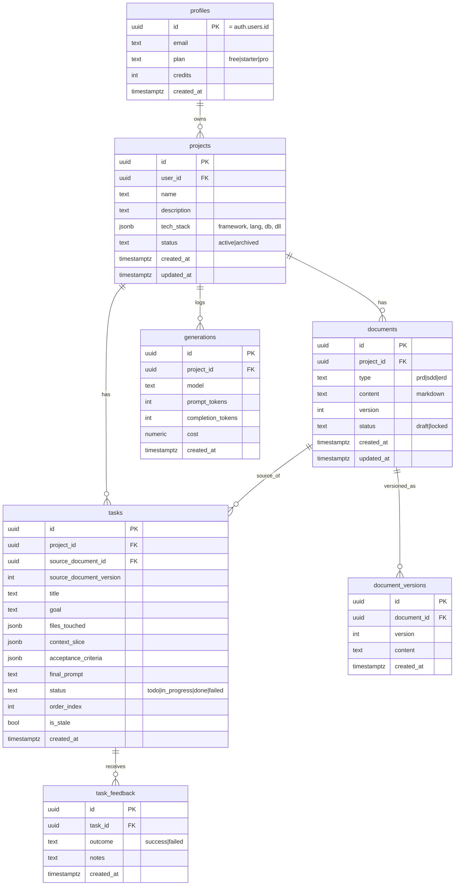

# DATABASE — Arsitek

Versi: 1.0 (MVP) · ORM: Drizzle · DB: Postgres (Supabase)

Skema ini adalah fondasi fitur pembeda (integritas konteks). Patuhi persis.
Relasi antar-artefak lah yang memungkinkan stale detection & konsistensi checker.

## ERD

## Catatan desain

- **profiles** memperluas `auth.users` Supabase (id sama). `credits` disiapkan
  untuk model kredit; belum ada payment di MVP.
- **documents.type** sudah menyertakan `sdd|erd` walau MVP hanya pakai `prd`. Ini
  agar fase berikutnya tidak perlu migrasi besar.
- **documents.version** naik tiap kali dokumen di-lock ulang setelah diedit. Nilai
  ini kunci stale detection.
- **document_versions** menyimpan riwayat isi tiap versi (untuk diff & regenerate).
- **tasks.source_document_version** merekam versi PRD saat task dibuat. Task stale
  bila `documents.version > tasks.source_document_version`.
- **tasks.context_slice** (jsonb) menyimpan potongan konteks relevan untuk task
  itu (entity terkait, aturan, dependensi). Fleksibel agar nanti bisa memuat
  potongan kode nyata (fitur codebase-aware) tanpa ubah skema.
- **tasks.acceptance_criteria** (jsonb) = array kriteria "selesai".
- **task_feedback** menopang loop belajar (Level 4): user menandai berhasil/gagal.
- **generations** mencatat biaya per generasi untuk basis kredit.

## Row-Level Security (Supabase)

Aktifkan RLS di semua tabel. Policy dasar: user hanya boleh SELECT/INSERT/UPDATE/
DELETE baris yang `user_id`-nya (atau lewat `project_id` → project milik dia) sama
dengan `auth.uid()`.

## Indeks yang disarankan

- `projects(user_id)`
- `documents(project_id, type)`
- `tasks(project_id, status)`
- `tasks(source_document_id)`
- `generations(project_id, created_at)`
